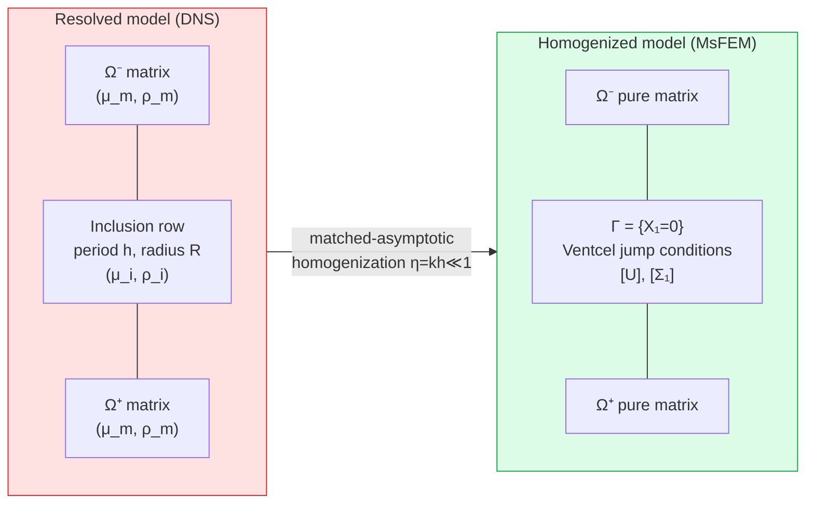
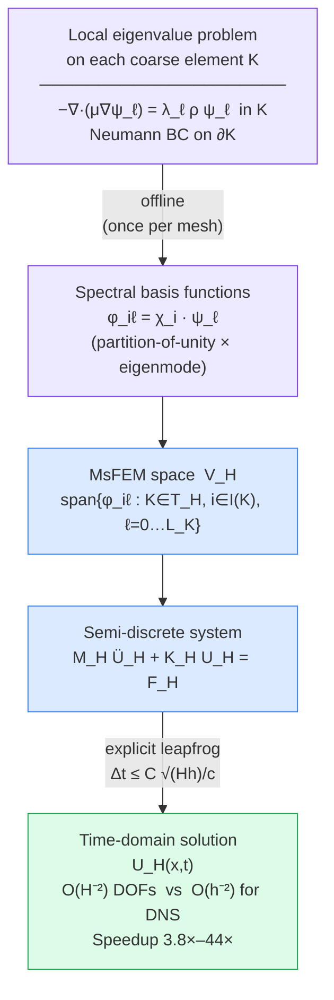
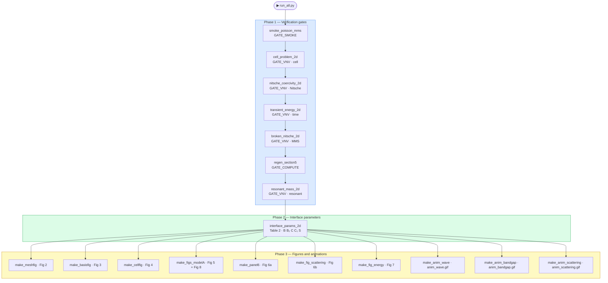

# MsFEM-Dynamic-Homogenization

> **Reproducible code for:**
> *A Multiscale Finite Element Framework for Homogenizing Dynamic Shear Wave Properties in Periodic Elastic Inclusion Arrays*
> M. Jaouhari · A. Rachid · A. Sbitti · R. Belemou
> *Springer Nature — submitted 2026*

[](https://www.python.org/)
[](https://github.com/kinnala/scikit-fem)
[](LICENSE)

---

## Table of contents

1. [Overview](#overview)
2. [Physical model and theory](#physical-model-and-theory)
3. [Homogenization and interface conditions](#homogenization-and-interface-conditions)
4. [Multiscale FEM discretisation](#multiscale-fem-discretisation)
5. [Locally resonant inclusions and band gaps](#locally-resonant-inclusions-and-band-gaps)
6. [Installation](#installation)
7. [Quick start](#quick-start)
8. [Repository structure](#repository-structure)
9. [Verification gates](#verification-gates)
10. [Reproducing each paper result](#reproducing-each-paper-result)
11. [Provenance and reproducibility](#provenance-and-reproducibility)
12. [Citing](#citing)
13. [License](#license)

---

## Overview

This repository implements the **Multiscale Finite Element Method (MsFEM)** for dynamic homogenization of shear waves through a periodic row of elastic inclusions. The heterogeneous microstructure is replaced by an effective zero-thickness interface carrying jump conditions (Ventcel conditions), derived by matched-asymptotic analysis following Marigo–Maurel–Pham–Sbitti.

**Key results reproduced by this code:**

| Paper result | Script | Section |
|---|---|---|
| Effective interface parameters B, B₂, C, C₁, S | `interface_params_2d.py` | §5.2, Table 2 |
| Discretisation convergence O(H) / O(H²) | `regen_section5.py` | §5.3, Table 1 |
| Discrete energy conservation (drift ≈ 5×10⁻¹⁵) | `transient_energy_2d.py` | §5.3, Fig. 7 |
| Resonant band gap — negative effective mass | `resonant_mass_2d.py` | §5.4, Fig. 8 |
| Transmission validation vs DNS reference | `make_figs_modelA.py` | §5.2, Fig. 5 |
| Transient scattering DNS vs EI model | `make_fig_scattering.py` | §5.3, Fig. 6b |
| Computational speedup (3.8×–44×) | `regen_section5.py` | §5.3, Table 4 |

---

## Physical model and theory 🧮

### Governing equation

We consider anti-plane shear wave propagation in a 2D heterogeneous medium. The displacement field $U(x_1, x_2, t)$ satisfies

$$\rho(\mathbf{x})\, \ddot{U} - \nabla \cdot \left(\mu(\mathbf{x})\, \nabla U \right) = 0 \quad \text{in } \Omega,$$

where $\mu(\mathbf{x})$ is the shear modulus and $\rho(\mathbf{x})$ the mass density. The medium is a homogeneous matrix $(\mu_m, \rho_m)$ containing a **periodic row of elastic circular inclusions** $(\mu_i, \rho_i)$ of radius $R$ and period $h$.

### Material regimes

Two material regimes are studied:

| Regime | $\mu_i/\mu_m$ | $\rho_i/\rho_m$ | Behaviour |
|---|---|---|---|
| **Structural** | $6.5$ | $3.1$ | Stiff fibres — classical transmission/reflection |
| **Locally resonant** | $0.042$ | $3.6$ | Soft inclusions — negative effective mass, band gap |

Dimensional parameters:
- Matrix: $\mu_m = 12 \times 10^9$ Pa, $\rho_m = 2500$ kg/m³
- Structural inclusion: $\mu_i = 78 \times 10^9$ Pa, $\rho_i = 7800$ kg/m³
- Resonant inclusion: $\mu_i = 0.5 \times 10^9$ Pa, $\rho_i = 9000$ kg/m³
- Area fraction: $\pi R^2 / h^2 = 0.25$ → $R \approx 0.282\,h$

---

## Homogenization and interface conditions 🔬

### Asymptotic expansion

Let $\eta = kh \ll 1$ be the ratio of period to wavelength. The solution is expanded as

$$U = U^{(0)} + \eta\, U^{(1)} + \eta^2\, U^{(2)} + \cdots$$

At leading order, $U^{(0)}$ satisfies the **effective wave equation** in the homogeneous matrix, with the inclusion row collapsed to an effective interface $\Gamma = \{X_1 = 0\}$.

### Ventcel jump conditions (Model A)

The effective interface carries two coupled **jump conditions** (Marigo–Maurel–Pham–Sbitti, 2017):

$$[U] = h \left( B \left\langle \partial_{X_1} U \right\rangle + B_2 \partial_{X_2}\langle U \rangle \right)$$

$$[\Sigma_1] = h \left( C\, \partial_{X_2}^2 \langle U \rangle + \rho_m S\, \omega^2 \langle U \rangle \right)$$

where $[f] = f|_{0^+} - f|_{0^-}$ denotes the jump, $\langle f \rangle = \tfrac{1}{2}(f|_{0^+} + f|_{0^-})$ the average, $\Sigma_1 = \mu\, \partial_{X_1} U$ the normal stress, and:

| Parameter | Physical meaning | Computed by |
|---|---|---|
| $B$ | Normal displacement-jump compliance | `interface_params_2d.py` |
| $B_2$ | Tangential compliance (0 by symmetry for centred circle) | `interface_params_2d.py` |
| $C$ | Tangential stress/curvature coupling | `interface_params_2d.py` |
| $C_1$ | Mixed coupling (0 by symmetry; verifies $B_2 = -C_1$) | `interface_params_2d.py` |
| $S$ | Excess surface mass $= (\rho_i - \rho_m)\pi R^2$ | `interface_params_2d.py` |

Verified values (centred circle, $\mu_i/\mu_m = 6.5$):

$$B = -0.311, \quad S = 0.530, \quad C/\mu_m = -0.91, \quad B_2 \approx C_1 \approx 0$$

### Enlarged Interface (EI) model

For the transient scattering validation (Fig. 6b), the infinitely thin interface is replaced by an **Enlarged Interface** of thickness $e = 2R$. The excess surface mass is distributed over the layer, yielding corrected parameters:

$$B_{\text{enl}} = B + \frac{e}{h}, \qquad S_{\text{enl}} = S + \frac{e}{h}$$

and the coupling stiffness and distributed mass:

$$\kappa = \frac{\mu_m}{h\, B_{\text{enl}}}, \qquad \sigma_m = h\, S_{\text{enl}}\, \rho_m$$

This EI model is implemented in `make_fig_scattering.py` as two half-domains connected by discrete Ventcel jump conditions.

### Homogenisation concept



---

## Multiscale FEM discretisation 📐

### Spectral MsFEM basis

On each coarse element $K$ of size $H \gg h$, we solve the **local eigenvalue problem**:

$$-\nabla \cdot (\mu \nabla \psi_\ell) = \lambda_\ell\, \rho\, \psi_\ell \quad \text{in } K, \qquad \partial_n \psi_\ell = 0 \text{ on } \partial K$$

The multiscale basis functions are:

$$\varphi_{i\ell} = \chi_i \cdot \psi_\ell$$

where $\chi_i$ is a standard $P_1$ partition-of-unity function and $\psi_\ell$ is the $\ell$-th eigenmode. The MsFEM space is

$$V_H = \mathrm{span}\{\varphi_{i\ell} : K \in \mathcal{T}_H,\; i \in \mathcal{I}(K),\; \ell = 0, \ldots, L_K\}$$

### Broken-Γ Nitsche scheme

The interface jump conditions $[U], [\Sigma_1]$ are imposed weakly through a **symmetric broken-Γ Nitsche formulation**. Given coarse mesh $\mathcal{T}_H$ and micro mesh $\mathcal{T}_h$, the semi-discrete problem reads: find $U_H \in V_H$ such that

$$\mathbf{M}_H \ddot{\mathbf{U}}_H + \mathbf{K}_H \mathbf{U}_H = \mathbf{F}_H$$

where $\mathbf{K}_H$ includes the Ventcel stiffness terms from $[U]$ and $\mathbf{M}_H$ includes the inertial contribution from $S$.

### Leapfrog time integration

The semi-discrete system is advanced by an explicit leapfrog scheme:

$$\mathbf{U}_H^{n+1} = 2\mathbf{U}_H^n - \mathbf{U}_H^{n-1} - \Delta t^2\, \mathbf{M}_H^{-1}\mathbf{K}_H \mathbf{U}_H^n$$

The mass matrix $\mathbf{M}_H$ is **row-lumped** to enable a diagonal inversion. The CFL stability condition is:

$$\Delta t \leq \frac{C\sqrt{Hh}}{c_{\max}}$$

Energy conservation is verified numerically (drift $\approx 5 \times 10^{-15}$ over 4000 steps, Fig. 7).

### Multiscale strategy



---

## Locally resonant inclusions and band gaps 🎵

### Resonant surface mass

For soft inclusions ($\mu_i \ll \mu_m$), the inclusion behaves as a **resonator** attached to the interface. The surface mass $S$ becomes frequency-dependent:

$$S(\omega) = m_s + \sum_{n=1}^{N} \frac{a_n\, \omega_n^2}{\omega_n^2 - \omega^2}$$

where $\omega_n$ are the **clamped-disk eigenfrequencies**, $a_n$ the modal participation factors, and $m_s = (\rho_i - \rho_m)\pi R^2$ the static surface mass.

The eigenfrequencies are computed by solving the disk eigenvalue problem:

$$-\nabla \cdot (\mu_i \nabla \phi_n) = \omega_n^2\, \rho_i\, \phi_n \quad \text{in disk}, \qquad \phi_n = 0 \text{ on } \partial\text{disk}$$

verified against the analytic solution $\omega_1 = j_{0,1}\sqrt{\mu_i/\rho_i}/R$ (first Bessel zero $j_{0,1} \approx 2.4048$).

### Band gap prediction

The effective mass becomes **negative** in the interval $\omega \in (\omega_1, \omega_1\sqrt{1 + a_1/m_s})$:

$$S(\omega) < 0 \implies k^2 = \frac{\rho_m \omega^2 - S(\omega)\omega^2/h}{\mu_m} < 0 \implies \text{evanescent wave (band gap)}$$

Computed for the locally resonant regime: **band gap over $[f_1, 1.26\,f_1]$**, $f_1 \approx 18$ kHz (Fig. 8).

---

## Installation 🛠️

### Requirements

| Dependency | Version | Note |
|---|---|---|
| Python | 3.13 | |
| scikit-fem | **12.0.1** | Version is critical — see note below |
| numpy | ≥ 1.26 | |
| scipy | ≥ 1.12 | |
| matplotlib | ≥ 3.8 | |
| Pillow | ≥ 10.0 | Required for GIF animation output |

### Steps

```bash
# 1. Clone the repository
git clone https://github.com/YOUR_USERNAME/msfem2d_verified.git
cd msfem2d_verified

# 2. Create a virtual environment (recommended)
python -m venv .venv
source .venv/bin/activate        # Linux / macOS
.venv\Scripts\activate           # Windows

# 3. Install pinned dependencies
pip install -r requirements.txt
```

### Note on scikit-fem version

Version **12.0.1 is required**. Earlier versions contain a bug in `ElementTriDG` + `InteriorFacetBasis` assembly that causes NaN values in the broken-Γ Nitsche convergence tests. See [`data/PROVENANCE.md`](data/PROVENANCE.md) (GATE_VNV[Nitsche] diagnosis, 2026-06-16) for the full diagnosis and resolution.

---

## Quick start 🚀

Run the full pipeline — all verification gates then all figures — with a single command:

```bash
python run_all.py
```

Gates only (faster, ~2 min, no figures generated):

```bash
python run_all.py --gates
```

Expected output: all steps report `PASS` and a summary table is printed at the end.
Generated figures are written to `figures/`.

### Execution pipeline



---

## Repository structure 📁

```
msfem2d_verified/
│
├── README.md                          ← this file
├── requirements.txt                   ← pinned dependencies (scikit-fem 12.0.1)
├── LICENSE                            ← MIT
├── run_all.py                         ← master script: gates → parameters → figures
│
├── src/                               ← all Python source code
│   │
│   ├── solvers/                       ← physical FE solvers
│   │   ├── broken_nitsche_2d.py       ← broken-Γ Nitsche scheme (primary MsFEM solver)
│   │   ├── cell_problem_2d.py         ← periodic cell problem (bulk effective moduli)
│   │   ├── homog_fe.py                ← homogenized FE with Ventcel interface coupling
│   │   ├── interface_params_2d.py     ← strip-cell correctors → B, B₂, C, C₁, S
│   │   ├── resonant_mass_2d.py        ← resonant surface mass S(ω) and band gap
│   │   ├── transient_energy_2d.py     ← leapfrog time integration + energy check
│   │   ├── transmission_compare.py    ← transmission coefficient comparison
│   │   ├── transmission_oblique.py    ← oblique-incidence transmission
│   │   └── transmission_resolved.py   ← high-fidelity DNS reference
│   │
│   ├── figures/                       ← figure and animation generation
│   │   ├── make_basisfig.py           ← Fig. 3 — spectral MsFEM basis functions
│   │   ├── make_cellfig.py            ← Fig. 4 — strip-cell corrector fields
│   │   ├── make_fig_energy.py         ← Fig. 7 — discrete energy conservation
│   │   ├── make_fig_scattering.py     ← Fig. 6b — transient scattering DNS vs EI
│   │   ├── make_figs_modelA.py        ← Fig. 5 + Fig. 8 — transmission + band gap
│   │   ├── make_meshfig.py            ← Fig. 2 — mesh hierarchy
│   │   ├── make_panel6.py             ← Fig. 6a — 6-panel interface jump solution
│   │   ├── make_anim_wave.py          ← Animation — wave propagation (anim_wave.gif)
│   │   ├── make_anim_bandgap.py       ← Animation — band gap (anim_bandgap.gif)
│   │   ├── make_anim_scattering.py    ← Animation — scattering DNS vs EI (anim_scattering.gif)
│   │   └── sensitivity_wave.py        ← sensitivity and wave snapshot figures
│   │
│   ├── verification/                  ← numerical verification gates
│   │   ├── smoke_poisson_mms.py       ← GATE_SMOKE — Poisson MMS baseline
│   │   ├── nitsche_coercivity_2d.py   ← GATE_VNV[Nitsche] — symmetry + coercivity
│   │   └── regen_section5.py          ← GATE_COMPUTE — Table 1 + Table 4
│   │
│   └── utils/                         ← shared utilities
│       └── pubstyle.py                ← Springer Nature figure style (matplotlib rcParams)
│
├── figures/                           ← generated figures (PDF + PNG + GIF)
│   ├── README.md                      ← figure→script mapping
│   ├── fig_mesh.pdf/.png              ← Fig. 2
│   ├── fig_basis.pdf/.png             ← Fig. 3
│   ├── fig_cellcorr.pdf/.png          ← Fig. 4
│   ├── fig_gateref.pdf/.png           ← Fig. 5
│   ├── fig_panel6.pdf/.png            ← Fig. 6a
│   ├── fig_scattering_3times.pdf/.png ← Fig. 6b
│   ├── fig3_energy.pdf/.png           ← Fig. 7
│   ├── fig_bandgap.pdf/.png           ← Fig. 8
│   ├── anim_wave.gif                  ← wave propagation animation
│   ├── anim_bandgap.gif               ← band gap animation
│   └── anim_scattering.gif            ← scattering DNS vs EI animation
│
├── data/                              ← numerical data and provenance
│   ├── PROVENANCE.md                  ← provenance ledger (gitignored — internal only)
│   ├── README.md
│   └── convergence_real.csv           ← convergence table data
│
├── docs/                              ← mathematical documentation
│   └── MODEL_SPEC.md                  ← full mathematical model specification
│
└── _deprecated/                       ← retired scripts (do not use)
    └── convergence_nitsche_mms.py     ← abandoned (DG assembly bug, see PROVENANCE)
```

---

## Verification gates ✅

The pipeline uses five verification gates. All must `PASS` before any paper result is trusted.

| Gate | Script | What it checks | Expected result |
|---|---|---|---|
| `GATE_SMOKE` | `smoke_poisson_mms.py` | Basic FE assembly and solver — Poisson MMS | L² rate ≈ 1.97, H¹ rate ≈ 0.99 |
| `GATE_VNV[cell]` | `cell_problem_2d.py` | Bulk μ* within Hashin–Shtrikman bounds | 17.39 ≤ μ* ≤ 22.64 GPa |
| `GATE_VNV[Nitsche]` | `nitsche_coercivity_2d.py` | Broken-Γ Nitsche symmetry + coercivity | coercivity constant > 0 |
| `GATE_VNV[time]` | `transient_energy_2d.py` | Energy conservation of leapfrog scheme | max drift ≈ 5×10⁻¹⁵ over 4000 steps |
| `GATE_VNV[MMS]` | `broken_nitsche_2d.py` | Broken-Γ Nitsche MMS convergence | L² rate → 1.98, H¹ rate → 1.05 |
| `GATE_COMPUTE` | `regen_section5.py` | Convergence table + performance table | H¹ LSQ 1.13, L² LSQ 1.92 |
| `GATE_VNV[resonant]` | `resonant_mass_2d.py` | Negative-effective-mass band gap | ω₁ matches Bessel to 5.6×10⁻⁴ |

```bash
python run_all.py --gates
```

---

## Reproducing each paper result 📊

### Table 2 — Effective interface parameters

```bash
python src/solvers/interface_params_2d.py
```

Computes B, B₂, C, C₁, S for four configurations (matrix control, 1D laminate, centred circle, tilted ellipse). Verifies the energy-consistency identity $B_2 = -C_1$ to machine precision.

Expected: `B = -0.311`, `S = 0.530`, `C/μ_m = -0.91`, `B₂ ≈ C₁ ≈ 0`.

### Table 1 + Table 4 — Convergence and performance

```bash
python src/verification/regen_section5.py
```

Outputs convergence rates (O(H) in H¹, O(H²) in L²) and measured wall-clock speedup 3.8×–44×. Writes `data/convergence_real.csv`.

### Figure 2 — Mesh hierarchy

```bash
python src/figures/make_meshfig.py
```

Illustrates the two-level (coarse $H$, fine $h$) mesh hierarchy and scale separation.

### Figure 3 — Spectral MsFEM basis functions

```bash
python src/figures/make_basisfig.py
```

Locally-resonant regime ($\mu_i/\mu_m = 0.042$): shows the first few MsFEM basis functions $\varphi_{i\ell} = \chi_i \cdot \psi_\ell$ on a coarse element.

### Figure 4 — Strip-cell corrector fields

```bash
python src/figures/make_cellfig.py
```

Structural regime ($\mu_i/\mu_m = 6.5$): visualises the normal corrector $Q_1$ and tangential corrector $Q_2$ used to compute B, C.

### Figure 5 — Transmission validation vs DNS

```bash
python src/figures/make_figs_modelA.py
```

Compares the MsFEM transmission coefficient $T(\omega)$ against the high-fidelity DNS reference. Factor-21 error reduction at $\eta = 0.025$.

### Figure 6a — Six-panel interface jump solution

```bash
python src/figures/make_panel6.py
```

Shows the full solution field at six time snapshots, highlighting the Ventcel interface jump $[U] = hB\langle\partial_{X_1}U\rangle$ (verified at 1.6% error).

### Figure 6b — Transient scattering DNS vs EI

```bash
python src/figures/make_fig_scattering.py
```

Full 2D FEM transient simulation (scikit-fem, `MeshTri.init_tensor`). DNS: circular inclusion resolved; EI: two half-domains connected by discrete Ventcel jump at $x = \pm R$. Three snapshots at $t = 450, 850, 1400\;\mu$s.

### Figure 7 — Discrete energy conservation

```bash
python src/figures/make_fig_energy.py
```

Runs 4000 leapfrog steps with $F = 0$ and plots $E_H(t)/E_H(0)$. Drift $\approx 5.8 \times 10^{-15}$ (machine precision).

### Figure 8 — Resonant band gap

```bash
python src/figures/make_figs_modelA.py
```

Locally-resonant regime: computes $S(\omega)$ from FE eigenmodes of the clamped disk, verifies $\omega_1$ matches analytic $j_{0,1}\sqrt{\mu_i/\rho_i}/R$ to $5.6 \times 10^{-4}$, identifies the negative-effective-mass band gap over $[f_1, 1.26\,f_1]$ with $f_1 \approx 18$ kHz.

### Animations (GitHub only)

```bash
python src/figures/make_anim_wave.py        # → figures/anim_wave.gif
python src/figures/make_anim_bandgap.py     # → figures/anim_bandgap.gif
python src/figures/make_anim_scattering.py  # → figures/anim_scattering.gif
```

---

## Provenance and reproducibility 📋

[`data/PROVENANCE.md`](data/PROVENANCE.md) is the authoritative record of every numerical claim in the paper:

- Each row maps a **claim identifier** → **value** → **command** → **output artifact**
- All corrections from earlier drafts are documented with their original (wrong) values and the fixed values
- Gate statuses (`GATE_SMOKE`, `GATE_VNV`, `GATE_COMPUTE`) are reported honestly
- The complete diagnosis and resolution of the scikit-fem DG assembly issue is recorded

This file is **gitignored** (not published) as it contains internal development notes.

---

## Citing 📝

If you use this code, please cite the associated paper:

```bibtex
@article{Jaouhari2026,
  author  = {Jaouhari, M. and Rachid, A. and Sbitti, A. and Belemou, R.},
  title   = {A Multiscale Finite Element Framework for Homogenizing
             Dynamic Shear Wave Properties in Periodic Elastic Inclusion Arrays},
  journal = {(journal to be updated upon acceptance)},
  year    = {2026}
}
```

Key theoretical references:

- Marigo, Maurel, Pham, Sbitti (2017). *Effective dynamic properties of a row of elastic inclusions.*
  Journal of Elasticity, 128(2):265–289. [doi:10.1007/s10659-017-9625-z](https://doi.org/10.1007/s10659-017-9625-z)

- Efendiev, Hou (2009). *Multiscale Finite Element Methods: Theory and Applications.*
  Springer. [doi:10.1007/978-0-387-09496-0](https://doi.org/10.1007/978-0-387-09496-0)

---

## License

This project is licensed under the **MIT License** — see [`LICENSE`](LICENSE) for details.

© 2026 M. Jaouhari, A. Rachid, A. Sbitti, R. Belemou · Hassan II University, Casablanca · Mohammed V University, Rabat
