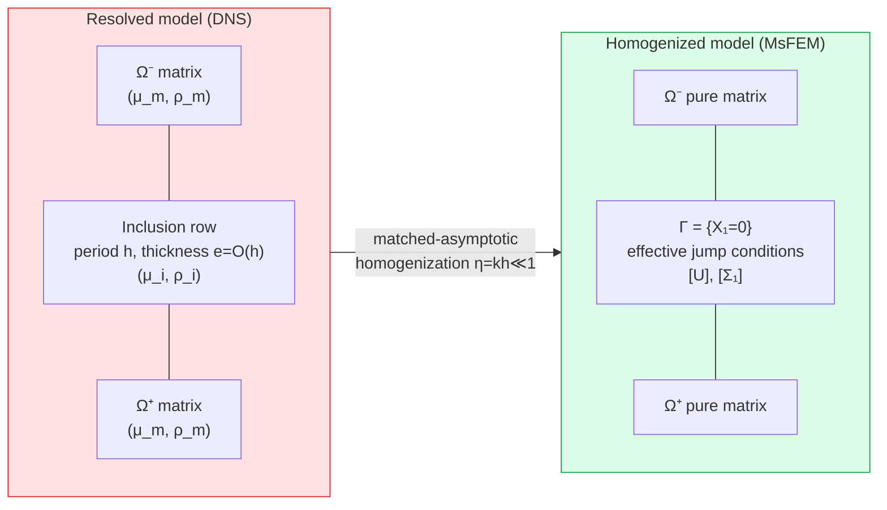
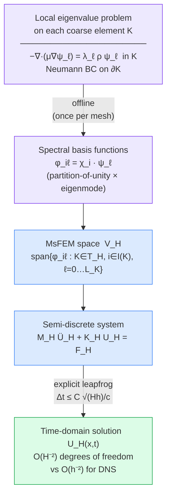
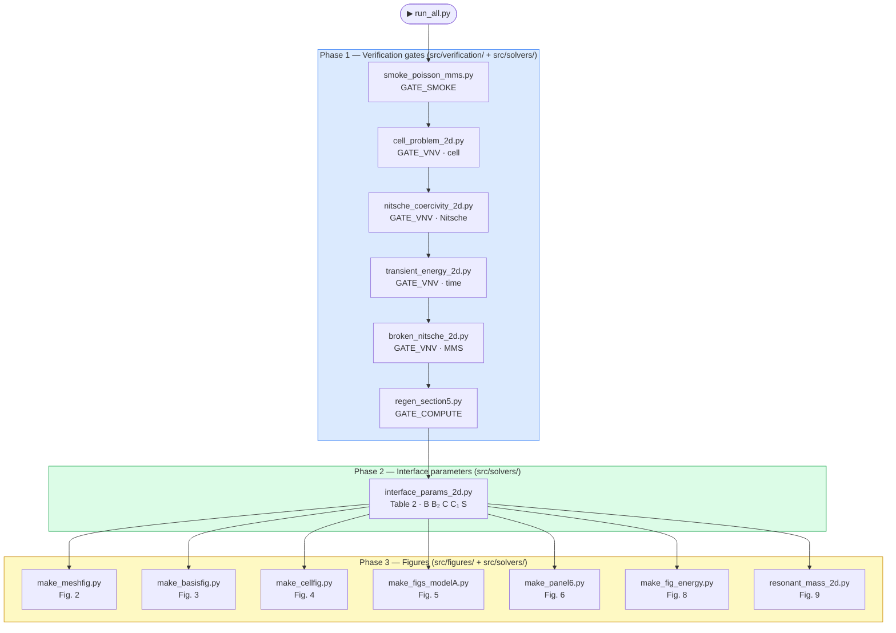
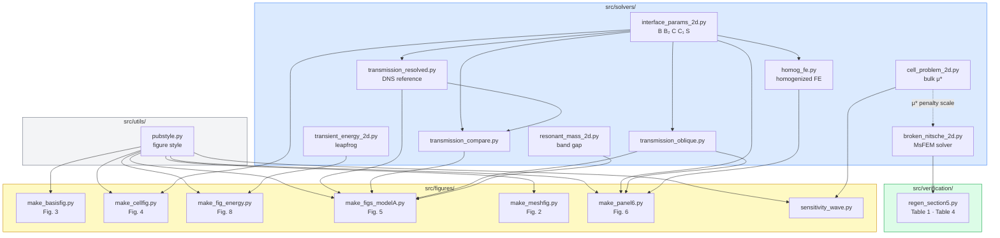

# MsFEM-Dynamic-Homogenization

> **Reproducible code for:**
> *A Multiscale Finite Element Framework for Homogenizing Dynamic Shear Wave Properties in Periodic Elastic Inclusion Arrays*
> M. Jaouhari · A. Rachid · A. Sbitti · R. Belemou
> Springer Nature — submitted 2026

[](https://www.python.org/)
[](https://github.com/kinnala/scikit-fem)
[](LICENSE)

Every numerical claim in the paper is traceable to a single command logged in [`data/PROVENANCE.md`](data/PROVENANCE.md). No result is hardcoded.

---

## Table of contents

1. [Overview](#overview)
2. [Physical model](#physical-model)
3. [Installation](#installation)
4. [Quick start](#quick-start)
5. [Repository structure](#repository-structure)
6. [Verification gates](#verification-gates)
7. [Reproducing each paper result](#reproducing-each-paper-result)
8. [Provenance and reproducibility](#provenance-and-reproducibility)
9. [Citing](#citing)
10. [License](#license)

---

## Overview

This repository implements the **Multiscale Finite Element Method (MsFEM)** for dynamic homogenization of shear waves through a periodic row of elastic inclusions. The microstructure is replaced by an effective zero-thickness interface carrying jump conditions (Model A), derived by matched-asymptotic analysis following Marigo–Maurel–Pham–Sbitti (J. Elasticity, 2017).

**Key results reproduced by this code:**

| Paper result | Script | Section |
|---|---|---|
| Effective interface parameters B, B₂, C, C₁, S | `interface_params_2d.py` | §5.2, Table 2 |
| Discretization convergence O(H) / O(H²) | `regen_section5.py` | §5.3, Table 1 |
| Discrete energy conservation (drift ≈ 5×10⁻¹⁵) | `transient_energy_2d.py` | §5.3, Fig. 8 |
| Resonant band gap — negative effective mass | `resonant_mass_2d.py` | §5.4, Fig. 9 |
| Transmission validation vs DNS reference | `make_figs_modelA.py` | §5.2, Fig. 5 |
| Computational speedup (3.8×–44×) | `regen_section5.py` | §5.3, Table 4 |

---

## Physical model

A single periodic row of elastic inclusions (period *h*, area fraction 0.25) is embedded in a homogeneous matrix. The row is replaced by an effective mean-line interface Γ = {X₁ = 0} carrying jump conditions:

```
[U]   = h ( B ⟨∂_{X₁}U⟩ + B₂ ∂_{X₂}⟨U⟩ )
[Σ₁]  = h ( C ∂²_{X₂}⟨U⟩ + ρ_m S ω² ⟨U⟩ )
```

The interface conditions are imposed weakly via a **symmetric Ventcel (imperfect-interface) coupling**. The full mathematical specification — corrector definitions, material parameters, and all verified values — is in [`docs/MODEL_SPEC.md`](docs/MODEL_SPEC.md).

### Homogenization concept



### Multiscale strategy



**Two material regimes:**
- **Structural** (stiff fibre, μᵢ/μₘ = 6.5): interface parameters and transmission validation
- **Locally resonant** (soft fibre, μᵢ/μₘ = 0.042): negative-effective-mass band gap

---

## Installation

### Requirements

| Dependency | Version | Note |
|---|---|---|
| Python | 3.13 | |
| scikit-fem | **12.0.1** | Version is critical — see [note below](#note-on-scikit-fem-version) |
| numpy | ≥ 1.26 | |
| scipy | ≥ 1.12 | |
| matplotlib | ≥ 3.8 | |

### Steps

```bash
# 1. Clone the repository
git clone https://github.com/jaouhari/MsFEM-Dynamic-Homogenization.git
cd MsFEM-Dynamic-Homogenization

# 2. Create a virtual environment (recommended)
python -m venv .venv
source .venv/bin/activate        # Linux / macOS
.venv\Scripts\activate           # Windows

# 3. Install pinned dependencies
pip install -r requirements.txt
```

### Note on scikit-fem version

Version **12.0.1 is required**. Earlier versions contain a bug in `ElementTriDG` + `InteriorFacetBasis` assembly that causes NaN values in discontinuous Galerkin convergence tests. See [`data/PROVENANCE.md`](data/PROVENANCE.md) (GATE\_VNV[Nitsche] diagnosis, 2026-06-16) for the full diagnosis and resolution.

---

## Quick start

Run the full pipeline — all verification gates then all figures — with a single command:

```bash
python run_all.py
```

Gates only (faster, ~2 min, no figures generated):

```bash
python run_all.py --gates
```

Expected output: all steps report `PASS` and a summary table is printed at the end. Generated figures are written to `../figures/`.

### Execution pipeline



---

## Repository structure

```
MsFEM-Dynamic-Homogenization/
│
├── README.md                        ← this file
├── requirements.txt                 ← pinned dependencies (scikit-fem 12.0.1)
├── LICENSE                          ← MIT
├── run_all.py                       ← master script: gates → parameters → figures
│
├── src/                             ← all Python source code
│   │
│   ├── solvers/                     ← physical FE solvers
│   │   ├── README.md
│   │   ├── broken_nitsche_2d.py     ← broken-Γ Nitsche scheme (primary MsFEM solver)
│   │   ├── cell_problem_2d.py       ← periodic cell problem (bulk effective moduli)
│   │   ├── homog_fe.py              ← homogenized FE with Ventcel interface coupling
│   │   ├── interface_params_2d.py   ← strip-cell correctors → B, B₂, C, C₁, S
│   │   ├── resonant_mass_2d.py      ← resonant surface mass S(ω) and band gap
│   │   ├── transient_energy_2d.py   ← leapfrog time integration + energy check
│   │   ├── transmission_compare.py  ← transmission coefficient comparison
│   │   ├── transmission_oblique.py  ← oblique-incidence transmission
│   │   └── transmission_resolved.py ← high-fidelity DNS reference
│   │
│   ├── figures/                     ← figure generation scripts
│   │   ├── README.md
│   │   ├── make_basisfig.py         ← Fig. 3 — spectral MsFEM basis functions
│   │   ├── make_cellfig.py          ← Fig. 4 — strip-cell corrector fields
│   │   ├── make_fig_energy.py       ← Fig. 8 — discrete energy conservation
│   │   ├── make_figs_modelA.py      ← Fig. 5 — transmission vs DNS reference
│   │   ├── make_meshfig.py          ← Fig. 2 — mesh hierarchy and scale separation
│   │   ├── make_panel6.py           ← Fig. 6 — 6-panel interface jump solution
│   │   └── sensitivity_wave.py      ← sensitivity and wave snapshot figures
│   │
│   ├── verification/                ← numerical verification gates
│   │   ├── README.md
│   │   ├── smoke_poisson_mms.py     ← GATE_SMOKE — Poisson MMS baseline
│   │   ├── nitsche_coercivity_2d.py ← GATE_VNV[Nitsche] — symmetry + coercivity
│   │   └── regen_section5.py        ← GATE_COMPUTE — Table 1 + Table 4
│   │
│   └── utils/                       ← shared utilities
│       ├── README.md
│       └── pubstyle.py              ← Springer Nature figure style (matplotlib rcParams)
│
├── data/                            ← numerical data and provenance
│   ├── README.md
│   ├── PROVENANCE.md                ← provenance ledger (every claim → command → artifact)
│   └── convergence_real.csv         ← convergence table data (output of regen_section5.py)
│
├── docs/                            ← mathematical documentation
│   ├── README.md
│   └── MODEL_SPEC.md                ← full mathematical model specification
│
└── _deprecated/                     ← retired scripts (do not use)
    ├── README.md
    └── convergence_nitsche_mms.py   ← abandoned (full-DG assembly bug, see PROVENANCE)
```

### Script dependency graph



---

## Verification gates

The pipeline uses four verification gates. All must `PASS` before any paper result is trusted.

| Gate | Script | What it checks | Expected result |
|---|---|---|---|
| `GATE_SMOKE` | `src/verification/smoke_poisson_mms.py` | Basic FE assembly and solver — Poisson MMS | L² rate ≈ 1.97, H¹ rate ≈ 0.99 |
| `GATE_VNV[cell]` | `src/solvers/cell_problem_2d.py` | Bulk μ* within Hashin–Shtrikman bounds | 17.39 ≤ μ* ≤ 22.64 GPa |
| `GATE_VNV[time]` | `src/solvers/transient_energy_2d.py` | Energy conservation of leapfrog scheme | max drift ≈ 5×10⁻¹⁵ over 4000 steps |
| `GATE_VNV[Nitsche]` | `src/solvers/broken_nitsche_2d.py` | Broken-Γ Nitsche MMS convergence | L² rate → 1.98, H¹ rate → 1.05 |
| `GATE_COMPUTE` | `src/verification/regen_section5.py` | Convergence table + performance table | H¹ LSQ 1.13, L² LSQ 1.92 |

Run all gates:

```bash
python run_all.py --gates
```

---

## Reproducing each paper result

### Table 2 — Effective interface parameters

```bash
python src/solvers/interface_params_2d.py
```

Computes B, B₂, C, C₁, S for four configurations (matrix control, 1D laminate, centred circle, tilted ellipse). Verifies the energy-consistency identity B₂ = −C₁ to machine precision.

### Table 1 + Table 4 — Convergence and performance

```bash
python src/verification/regen_section5.py
```

Outputs convergence rates (O(H) in H¹, O(H²) in L²) and measured wall-clock speedup. Writes `data/convergence_real.csv`.

### Figure 2 — Mesh hierarchy

```bash
python src/figures/make_meshfig.py
```

### Figure 3 — Spectral MsFEM basis functions

```bash
python src/figures/make_basisfig.py
```

### Figure 4 — Strip-cell corrector fields

```bash
python src/figures/make_cellfig.py
```

### Figure 5 — Transmission validation vs DNS

```bash
python src/figures/make_figs_modelA.py
```

Validates effective parameters against a high-fidelity DNS reference. Factor-21 error reduction at η = 0.025.

### Figure 6 — Six-panel interface jump solution

```bash
python src/figures/make_panel6.py
```

### Figure 8 — Discrete energy conservation

```bash
python src/figures/make_fig_energy.py
```

Runs 4000 leapfrog steps with f = 0 and plots E_H(t)/E_H(0). Drift ≈ 5.8×10⁻¹⁵ (machine precision).

### Figure 9 — Resonant band gap

```bash
python src/solvers/resonant_mass_2d.py
```

Locally-resonant regime: computes S(ω), verifies ω₁ matches analytic clamped-disk value to 5.6×10⁻⁴, and identifies the negative-effective-mass band gap over [18.1, 22.7] kHz.

---

## Provenance and reproducibility

[`data/PROVENANCE.md`](data/PROVENANCE.md) is the authoritative record of every numerical claim in the paper:

- Each row maps a **claim identifier** → **value** → **command** → **output artifact**
- All corrections from earlier drafts are documented with their original (wrong) values and the fixed values
- Gate statuses (`GATE_SMOKE`, `GATE_VNV`, `GATE_COMPUTE`, `GATE_REF`) are reported honestly, including partial or open statuses
- The complete diagnosis and resolution of the scikit-fem DG assembly issue is recorded

No value in the paper is asserted without a corresponding entry in this ledger.

---

## Citing

If you use this code, please cite the associated paper:

```bibtex
@article{Jaouhari2026,
  author  = {M. Jaouhari and A. Rachid and A. Sbitti and R. Belemou},
  title   = {A Multiscale Finite Element Framework for Homogenizing Dynamic
             Shear Wave Properties in Periodic Elastic Inclusion Arrays},
  journal = {(journal name to be updated upon acceptance)},
  year    = {2026}
}
```

---

## License

This project is licensed under the **MIT License** — see [`LICENSE`](LICENSE) for details.

© 2026 M. Jaouhari, A. Rachid, A. Sbitti, R. Belemou · Hassan II University, Casablanca · Mohammed V University, Rabat
